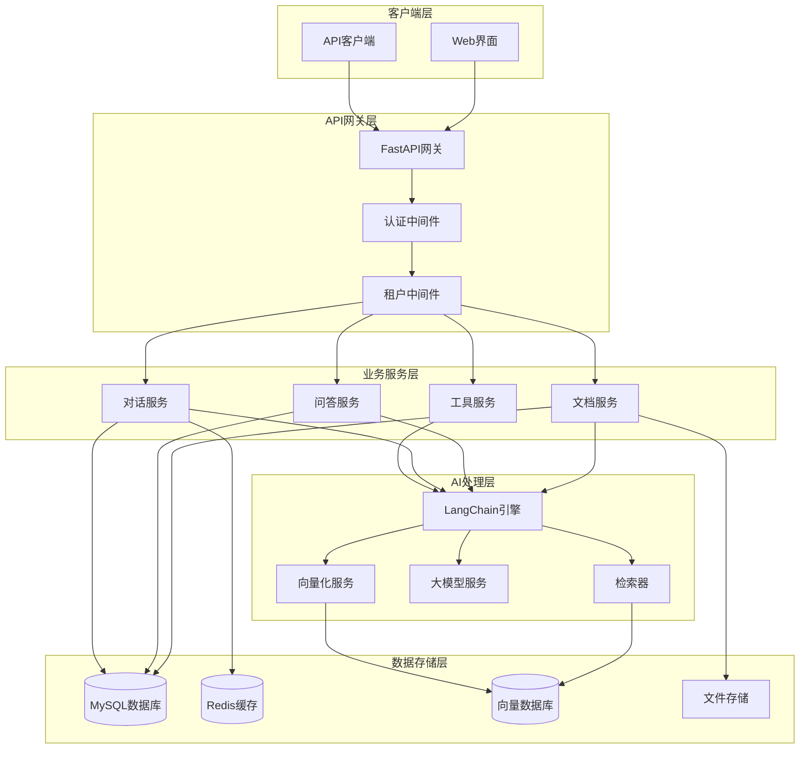
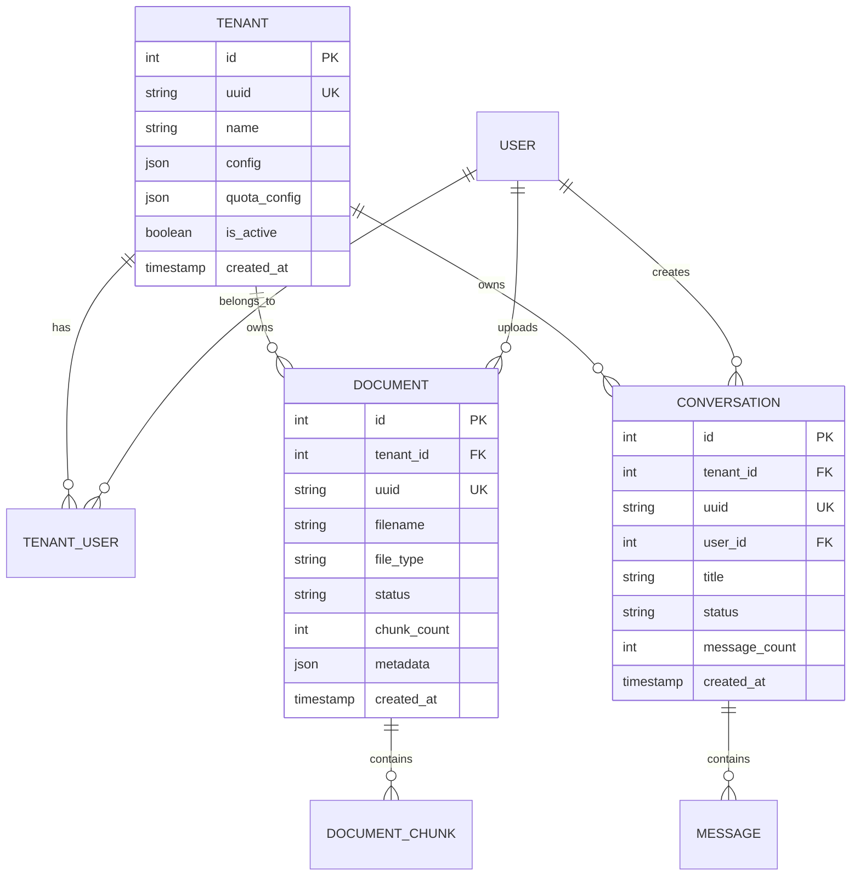

# 设计文档

## 概述

智能问答知识库系统基于现有的FastAPI后端架构，集成LangChain框架构建企业级的RAG（检索增强生成）问答平台。系统采用微服务架构，支持多租户、文档管理、向量检索、多轮对话等核心功能。

### 技术栈
- **后端框架**: FastAPI (现有)
- **AI框架**: LangChain
- **向量数据库**: Chroma/Qdrant
- **数据库**: MySQL (现有) + Redis (现有)
- **文档处理**: PyPDF2, python-docx, unstructured
- **向量化**: OpenAI Embeddings / HuggingFace Embeddings
- **大模型**: OpenAI GPT / Claude / 本地模型

## 架构

### 系统架构图



### 多租户架构

系统采用数据库级别的多租户隔离：
- 每个租户拥有独立的数据空间标识 (tenant_id)
- 向量数据库按租户分collection存储
- Redis缓存使用租户前缀隔离
- 文件存储按租户目录组织

## 组件和接口

### 1. 租户管理组件

```python
# 租户模型
class Tenant(Base):
    __tablename__ = "tenants"
    
    id = Column(Integer, primary_key=True)
    uuid = Column(String(36), unique=True)
    name = Column(String(100), nullable=False)
    config = Column(JSON)  # 租户配置
    quota_config = Column(JSON)  # 配额配置
    is_active = Column(Boolean, default=True)
    created_at = Column(TIMESTAMP, server_default=func.now())

# 租户用户关联
class TenantUser(Base):
    __tablename__ = "tenant_users"
    
    tenant_id = Column(Integer, ForeignKey("tenants.id"))
    user_id = Column(Integer, ForeignKey("users.id"))
    role = Column(String(50), default="member")  # admin, member, viewer
```

### 2. 文档管理组件

```python
# 文档模型
class Document(Base):
    __tablename__ = "documents"
    
    id = Column(Integer, primary_key=True)
    tenant_id = Column(Integer, ForeignKey("tenants.id"))
    uuid = Column(String(36), unique=True)
    filename = Column(String(255), nullable=False)
    file_type = Column(String(50))  # pdf, docx, txt, md
    file_size = Column(Integer)
    file_path = Column(String(500))
    status = Column(String(50))  # uploading, processing, completed, failed
    chunk_count = Column(Integer, default=0)
    metadata = Column(JSON)
    created_by = Column(Integer, ForeignKey("users.id"))
    created_at = Column(TIMESTAMP, server_default=func.now())

# 文档块模型
class DocumentChunk(Base):
    __tablename__ = "document_chunks"
    
    id = Column(Integer, primary_key=True)
    document_id = Column(Integer, ForeignKey("documents.id"))
    chunk_index = Column(Integer)
    content = Column(Text)
    metadata = Column(JSON)
    vector_id = Column(String(100))  # 向量数据库中的ID
```

### 3. 对话管理组件

```python
# 对话会话模型
class Conversation(Base):
    __tablename__ = "conversations"
    
    id = Column(Integer, primary_key=True)
    tenant_id = Column(Integer, ForeignKey("tenants.id"))
    uuid = Column(String(36), unique=True)
    user_id = Column(Integer, ForeignKey("users.id"))
    title = Column(String(200))
    status = Column(String(50))  # active, archived, deleted
    message_count = Column(Integer, default=0)
    created_at = Column(TIMESTAMP, server_default=func.now())
    updated_at = Column(TIMESTAMP, server_default=func.now())

# 对话消息模型
class Message(Base):
    __tablename__ = "messages"
    
    id = Column(Integer, primary_key=True)
    conversation_id = Column(Integer, ForeignKey("conversations.id"))
    role = Column(String(20))  # user, assistant, system
    content = Column(Text)
    metadata = Column(JSON)  # 包含来源文档、工具调用等信息
    created_at = Column(TIMESTAMP, server_default=func.now())
```

### 4. LangChain集成组件

```python
# LangChain服务接口
class LangChainService:
    def __init__(self, tenant_id: int):
        self.tenant_id = tenant_id
        self.vector_store = self._init_vector_store()
        self.llm = self._init_llm()
        self.retriever = self._init_retriever()
        
    def _init_vector_store(self):
        # 初始化租户专用的向量存储
        pass
        
    def _init_llm(self):
        # 初始化大模型
        pass
        
    def _init_retriever(self):
        # 初始化检索器
        pass
        
    async def process_document(self, document_path: str) -> List[DocumentChunk]:
        # 文档处理和向量化
        pass
        
    async def query(self, question: str, conversation_history: List[Message]) -> str:
        # RAG查询处理
        pass
        
    async def chat(self, message: str, conversation_id: str) -> str:
        # 多轮对话处理
        pass
```

### 5. API接口设计

```python
# 文档管理API
@router.post("/documents/upload")
async def upload_document(file: UploadFile, tenant_id: int = Depends(get_current_tenant))

@router.get("/documents")
async def list_documents(tenant_id: int = Depends(get_current_tenant))

@router.delete("/documents/{document_id}")
async def delete_document(document_id: int, tenant_id: int = Depends(get_current_tenant))

# 问答API
@router.post("/qa/query")
async def query_knowledge_base(query: QueryRequest, tenant_id: int = Depends(get_current_tenant))

# 对话API
@router.post("/conversations")
async def create_conversation(tenant_id: int = Depends(get_current_tenant))

@router.post("/conversations/{conversation_id}/messages")
async def send_message(conversation_id: str, message: MessageRequest)

@router.get("/conversations/{conversation_id}/messages")
async def get_conversation_history(conversation_id: str)
```

## 数据模型

### 核心数据关系



### 向量数据库设计

```python
# Chroma Collection命名规范
collection_name = f"tenant_{tenant_id}_documents"

# 向量元数据结构
metadata = {
    "document_id": int,
    "chunk_index": int,
    "document_name": str,
    "file_type": str,
    "tenant_id": int,
    "created_at": str
}
```

## 错误处理

### 错误分类和处理策略

1. **文档处理错误**
   - 文件格式不支持：返回明确错误信息
   - 文件损坏：记录日志，标记文档状态为失败
   - 向量化失败：重试机制，超过次数后标记失败

2. **大模型调用错误**
   - API限流：实现指数退避重试
   - 模型不可用：自动切换备用模型
   - 响应超时：设置合理超时时间，提供降级响应

3. **检索错误**
   - 向量数据库连接失败：使用缓存或降级到关键词搜索
   - 检索结果为空：提供友好提示和建议

4. **租户隔离错误**
   - 跨租户访问：立即拒绝并记录安全日志
   - 配额超限：提供明确的限制信息和升级建议

### 错误响应格式

```python
class ErrorResponse(BaseModel):
    error_code: str
    error_message: str
    details: Optional[Dict] = None
    timestamp: datetime
    request_id: str
```

## 测试策略

### 单元测试
- 文档处理组件测试
- 向量检索功能测试
- 多租户隔离测试
- LangChain集成测试

### 集成测试
- 端到端问答流程测试
- 多轮对话功能测试
- 文档上传到检索完整流程测试

### 性能测试
- 大文档处理性能测试
- 并发查询性能测试
- 向量检索响应时间测试

### 安全测试
- 租户数据隔离测试
- 权限控制测试
- 输入验证和SQL注入防护测试

## 部署和扩展

### 容器化部署
```dockerfile
# 基础镜像包含Python和LangChain依赖
FROM python:3.11-slim

# 安装系统依赖
RUN apt-get update && apt-get install -y \
    build-essential \
    && rm -rf /var/lib/apt/lists/*

# 安装Python依赖
COPY requirements.txt .
RUN pip install -r requirements.txt

# 应用代码
COPY . /app
WORKDIR /app

CMD ["uvicorn", "app.main:app", "--host", "0.0.0.0", "--port", "8000"]
```

### 扩展性考虑
- 向量数据库支持水平扩展
- Redis集群支持会话共享
- 大模型服务支持负载均衡
- 文件存储支持对象存储服务

### 监控和日志
- 应用性能监控 (APM)
- 大模型调用监控和成本跟踪
- 用户行为分析和审计日志
- 系统资源使用监控